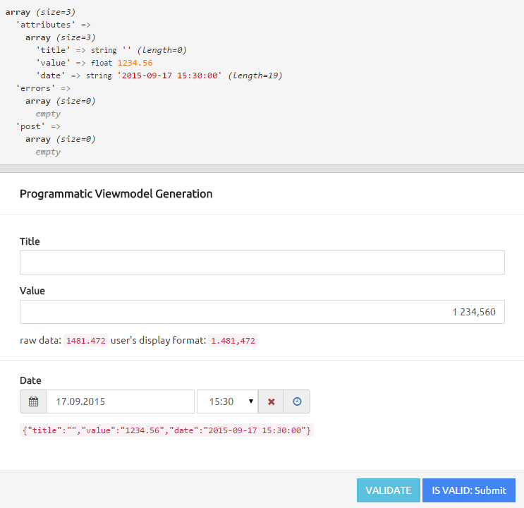

Knockout Viewmodel Generator for Yii2
=====================================
This extension provides a replacement for **ActiveForm**.
A **KnockoutJS viewmodel** is automatically generated (using knockout mapping lib),
which serves a starting point for your customization, e.g. computed observables.
Moreover you get some more input types, like "**decimal**", "**percent**", "**date**" and "**datetime**",
which display the raw data in the user's locale format and store the data in ISO-format.


Installation
------------

The preferred way to install this extension is through [composer](http://getcomposer.org/download/).

Either run

```
php composer.phar require --prefer-dist e-frank/yii2-knockout "*"
```

or add

```
"e-frank/yii2-knockout": "*"
```

to the require section of your `composer.json` file.


Usage
-----
example code for a view.
note that you would place model load and validation code in your controller/action.


```php
<?php
use x1\knockout\ActiveForm;

$this->title  = 'Programmatic Viewmodel Generation';
	
// init data from default or post
$post = Yii::$app->request->post();
$data = empty($post) ? [
	'title' => '', 
	'value' => 1234.56, 
	'date'  => sprintf('%s%d:00', date('Y-m-d H:'), date('i') - (date('i') % 15))
	] : $post['DynamicModel'] ;

// create a dynamic model, for demonstration purpose
$model = new yii\base\DynamicModel($data);
$model->addRule(['title'], 'string', ['max' => 128]);
$model->addRule(['title'], 'required');
$model->addRule(['value'], 'number', ['min' => 0]);

// validate, usually done in controller
if (!empty($post)) {
	$model->validate();
}

// show what we have got
var_dump([
	'attributes' => $model->attributes,
	'errors'     => $model->getErrors(),
	'post'       => $post,
	]);

?>

<? $form = ActiveForm::begin(['errors' => $model->getErrors(), 'defaults' => ['decimals' => 3]]); ?>
<div class="panel panel-default">
    <div class="panel-heading"><?= $this->title ?></div>
    <div class="panel-body">
		<?= $form->field($model, 'title') ?>
		<?#= $form->field($model, 'value')->decimal(['decimal' => ['thousandsSeparator' => ' ']]) ?>
		<?= $form->field($model, 'value')->decimal() ?>
		raw data: <code data-bind="text: comp" class="text-right"></code>
		user's display format: <code data-bind="text: comp.display" class="text-right"></code>
		<hr />
		<?= $form->field($model, 'date')->datetime() ?>
		<code data-bind="text: JSON.stringify(ko.mapping.toJS($data))"></code>

    </div>
	<div class="panel-footer">
		<div class="text-right">
			<button data-bind="click: validate" class="btn btn-info">
				VALIDATE
			</button>
			<button data-bind="
				text:   hasError() ? 'HAS ERRORS' : 'IS VALID: Submit', 
				css:    {'btn-primary': !hasError(), 'btn-danger': hasError()},
				enable: !hasError()"
				class="btn">
			</button>
		</div>
	</div>
</div>
<? ActiveForm::end() ?>
```


custom viewModel enhancements, located at the end of your view, after all other scripts are loaded:
```php
<script>
mapping.viewModel = function(self) {
	console.log(self, x1);
    
    self.comp = ko.pureComputed(function() {
    	return self.value() * 1.2;
    }).extend({"decimal":null});

    // must return self
    return self;
}
</script>
```


the demo page should look like this:

